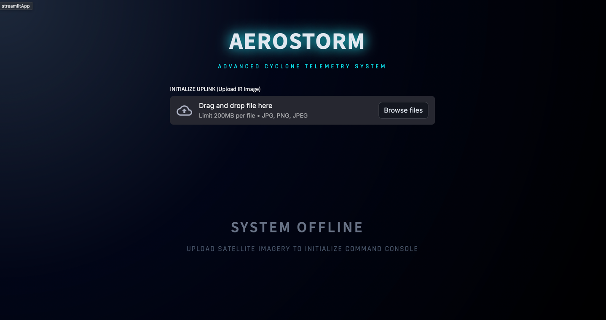
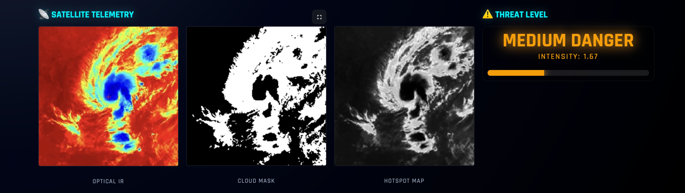
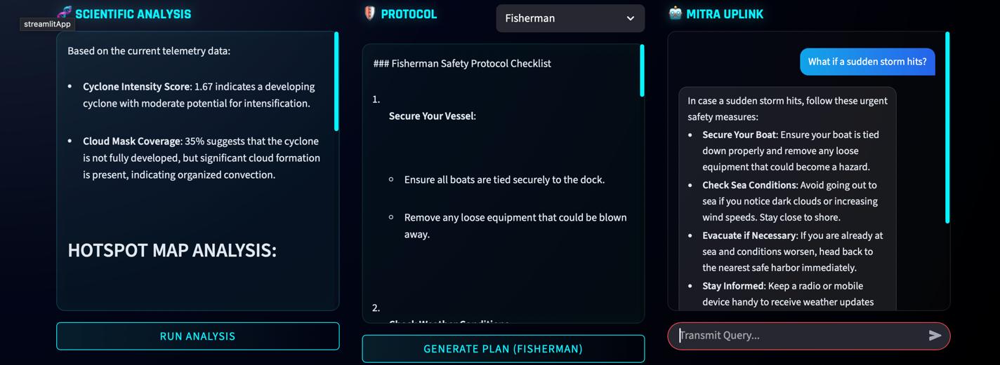

# AEROSTORM: AI-Powered Cyclone Telemetry & Safety System
### _A Gen-AI solution bridging the gap between Satellite Telemetry and Rural Safety_

---

## The Problem
India has **7,500 km of cyclone-prone coastline**, yet real-time disaster insights fail to reach the **“last mile.”**

Current systems suffer from:
- Too technical for farmers and fishermen  
- Too slow to disseminate urgent warnings  
- No **role-specific** safety protocols  

---

##  The Solution — AEROSTORM
AEROSTORM is a hybrid AI platform combining **Computer Vision (CycloneBeast)** with **Generative AI (Mitra)** to deliver real-time, **personalized cyclone safety intelligence**.

---

##  Key Features

###  CycloneBeast (Custom CNN)
- PyTorch-based custom CNN
- Processes **Infrared Satellite imagery**
- Detects **Danger Level** & **Storm Intensity**

###  Visual Proof of Cyclone Intensity
- **Cloud Masks**
- **Thermal Hotspot Heatmaps**
- **CLAHE contrast enhancement**

###  Mitra AI — The Safety Companion
A role-locked Gen-AI assistant that transforms technical weather signals into **clear survival instructions**.

#### Mitra generates safety protocols based on the user's role:
| User | Mitra Response Example |
|------|------------------------|
| Fishermen | Secure nets, anchor boats, sea-entry ban |
| Villagers | Livestock protection, ration stocking |
| Coastal citizens | Emergency kits, window taping, safe zones |
| NGOs & Responders | Evacuation priorities, resource mapping |

---

##  Screenshots

📌 Model Dashboard 



📌 Heatmap & Cloud Mask Output  



📌 Mitra AI Interface


---

## 🛠️ Tech Stack

| Module | Technology                         |
|--------|------------------------------------|
| Language | Python 3.10+                       |
| ML Engine | PyTorch — Custom CNN               |
| Gen-AI | OpenAI GPT-4.1 + LangChain         |
| UI | Streamlit (Sci-Fi Command Console) |
| Processing | PIL, NumPy, CLAHE, Thermal Mapping |

---

##  Run Locally (Developer Mode)

```bash
git clone https://github.com/Morpheus-xz/AEROSTORM.git
cd AEROSTORM
pip install -r requirements.txt
```

Create `.env` file:
```
OPENAI_API_KEY=sk-proj-xxxx
```

Launch:
```bash
streamlit run app.py
```

---

##  Live Demo (No Installation Required)
Experience AEROSTORM instantly — no setup required.

🔗 **👉 Launch AEROSTORM Live**  
https://aerostorm.streamlit.app  
*(Streamlit Cloud — Beast Mode Model + Mitra Gen-AI Companion)*

---

##  Impact
✔️ First AI system to deliver **vision-grounded cyclone safety instructions**  
✔️ Converts satellite imagery → **actionable survival guidance**  
✔️ Optimized for **farmers, fishermen, NGOs, coastal citizens & responders**

---

## 🏆 Built For
**NxtWave x OpenAI GenAI Hackathon 2025**

---

##  Team AEROSTORM
| Member             | Responsibility |
|--------------------|----------------|
| Vedansh Agarwal    | All core logic, CNN model, Gen-AI pipeline, UI |
| Suryansh Raj Singh | Deployment, hosting, optimization, documentation & presentation |

---

###  Support the Project
If you like AEROSTORM, please give the repo a **star** — it motivates us 🌟

```
git push && win the hackathon 
```


